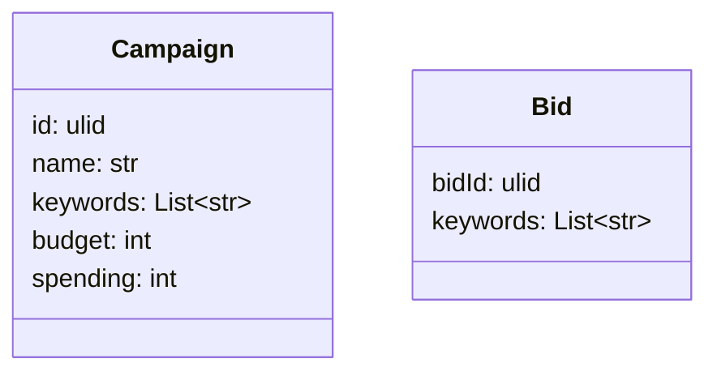

```mermaid
classDiagram
    class Campaign {
        id: ulid
        name: str
        keywords: List~str~
        budget: int
        spending: int
    }

    class Bid {
        bidId: ulid
        keywords: List~str~
    }
    
```